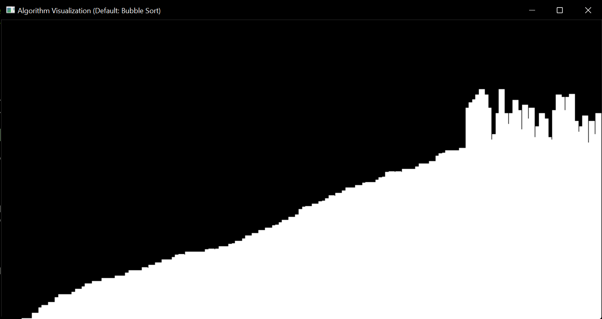

# AlgoVisualizer
 Visualizes Sorting algorithms in OpenGL (Decentralized).
 Right now, Bubble Sort and Selection Sort have been visualized, will do others in the coming few units of time.

# Screenshots
## Bubble Sort

## Selection Sort

