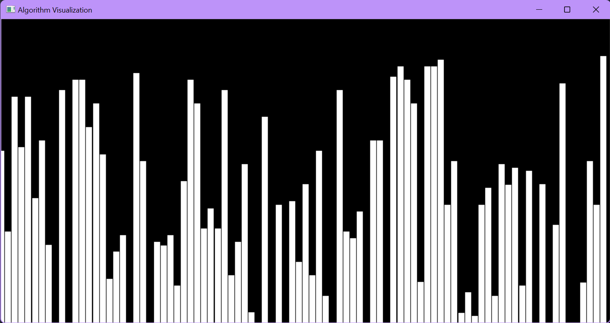
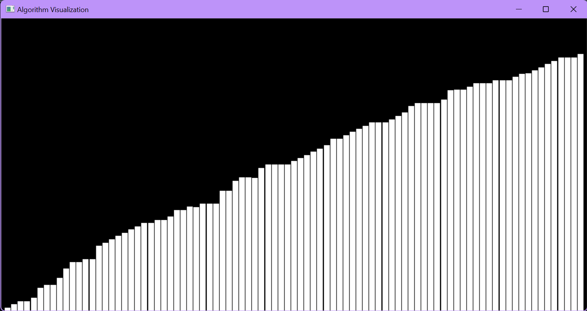

# AlgoVisualizer
 Visualizes Sorting algorithms in OpenGL.
 Right now, Bubble Sort and Merge Sort has been visualized, will do others in the coming few units of time.

# Screenshots
## Bubble Sort

